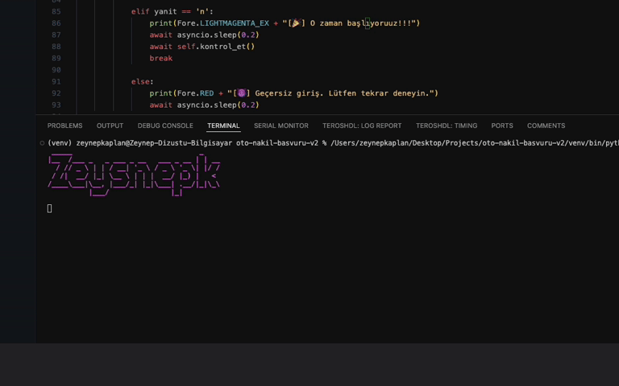

# 🎓 Otomatik Okul Nakil Başvuru Sistemi

MEB ortaöğretim için okul kontenjanlarını takip eden ve boş kontenjan bulunduğunda otomatik olarak nakil başvurusu yapıp verilen mail ile bilgilendirme yapan Python tabanlı otomasyon sistemi.

## 🎬 Çalışma Şekli


## ✨ Özellikler

- 🔄 Otomatik kontenjan takibi
- 📝 Boş kontenjan bulunduğunda otomatik başvuru
- 🔐 E-devlet entegrasyonu
- 🤖 CAPTCHA çözme yeteneği
- 📧 E-posta bildirimleri
- 🎨 Renkli komut satırı arayüzü
- ⏰ Ayarlanabilir kontrol aralıkları
- 🛠️ Anlık bilgi güncelleme imkanı

## 📋 Gereksinimler

- 🐍 Python 3.8 veya üzeri
- 🌐 Chrome/Chromium tarayıcı
- 🔑 Aktif e-devlet hesabı
- 📮 Gmail hesabı (bildirimler için)

## ⚠️ Önemli Notlar

- **E-devlet Güvenlik Ayarları:**
  - E-devlet hesabınızda 2 aşamalı doğrulama **KAPALI** olmalıdır
  - Sadece şifre ile giriş yapılabilir durumda olmalıdır
  - SMS veya e-posta doğrulaması aktif olmamalıdır

- **Gmail Güvenlik Ayarları:**
  - Gmail hesabınızda 2 aşamalı doğrulama **AÇIK** olmalıdır
  - Uygulama şifresi (App Password) oluşturulmalıdır
  - Oluşturulan uygulama şifresi `config.json` dosyasında `mail_app_sifre` alanına yazılmalıdır

### 📧 E-posta Ayarları

E-posta bildirimlerini etkinleştirmek için:
1. Google Hesap ayarlarınıza gidin
2. 2 Adımlı Doğrulamayı etkinleştirin
3. Uygulama için App Password (Uygulama Şifresi) oluşturun
4. Bu şifreyi `mail_app_sifre` alanında kullanın


## 💻 Kurulum

1. Projeyi bilgisayarınıza indirin:
```bash
git clone https://github.com/zeysnepk/oto-nakil-basvuru.git
cd okul-nakil-otomasyonu
```

2. Gerekli paketleri yükleyin:
```bash
pip install -r requirements.txt
```

3. Playwright tarayıcılarını yükleyin:
```bash
playwright install
```

## ⚙️ Yapılandırma

`config.json` dosyasındaki bilgileri tanımlamanız gerekmektedir:
```json
{
    "mail_gonderen": "mailiniz@gmail.com",
    "mail_app_sifre": "uygulama-sifreniz",
    "mail_alan": "alici.mail@gmail.com",
    "saniye": "600"
}
```

## 🚀 Kullanım

Ana uygulamayı çalıştırın:
```bash
python main.py
```
Eğer script çalışırken bilgileri değiştirmek isterseniz, şu komut istemi görüntülenecektir:
```bash
[👀] Bilgileri değiştirmek ister misinizz???(Y/n) :
```
Eğer 1 dakika boyunca yanıt verilmezse, sistem otomatik olarak kontrol_et() fonksiyonunu çağırarak süreci devam ettirir.


Uygulama şunları yapacaktır:
1. Belirtilen aralıklarla kontenjan kontrolü başlatır
2. Boş kontenjan bulunduğunda otomatik başvuru yapar
3. Başvuru durumu hakkında e-posta bildirimleri gönderir
4. Çalışma sırasında ayarları değiştirmenize olanak tanır

## 🎯 Etkileşimli Seçenekler

Çalışma sırasında:
- Öğrenci bilgilerini düzenleyebilir
- Hedef okulları değiştirebilir
- Kontrol aralıklarını güncelleyebilir
- Başvuru detaylarını değiştirebilir
- Mevcut okulları ve kontenjanları görüntüleyebilirsiniz

## 📁 Proje Yapısı

- `main.py`: Ana uygulama başlangıç noktası
- `kontenjan.py`: Kontenjan takip işlevleri
- `basvuru.py`: Nakil başvuru işlemleri
- `config.json`: Yapılandırma dosyası
- `requirements.txt`: Gerekli Python paketleri

## 🛡️ Hata Yönetimi

Sistem şunları içerir:
- İnternet bağlantısı izleme
- Otomatik yeniden deneme mekanizmaları
- Güvenli kapatma prosedürleri
- Hata bildirimleri
- CAPTCHA çözme yetenekleri

## ⚠️ Bilinen Sınırlamalar

- Sadece Türkiye e-devlet sistemi ile çalışır
- Chrome/Chromium tarayıcı gerektirir
- Bildirimler için sadece Gmail desteklenir
- CAPTCHA çözümü bazen uzun sürebilir

## 🔒 Güvenlik Notları

- `config.json` dosyasını güvende tutun, hassas bilgiler içerir
- E-devlet bilgilerinizi asla paylaşmayın
- Bildirimler için ayrı bir Gmail hesabı kullanın
- Şifrelerinizi düzenli olarak güncelleyin

## 🤝 Katkıda Bulunma

Eğer projeye katkı sağlamak isterseniz, **pull request** gönderebilir veya `Issues` sekmesinde geri bildirimde bulunabilirsiniz.
